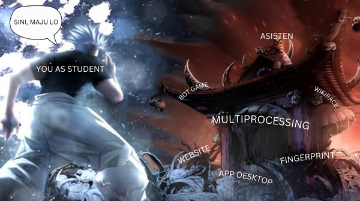
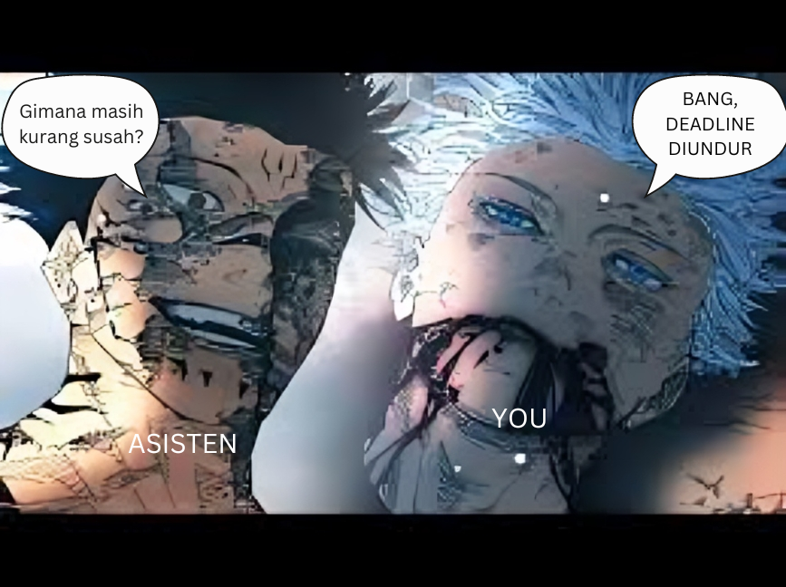

# Summon-Tubes

> Task Seleksi Lab IRK created by Sulthan Dzaky Alfaro

versi **6 Juli 2024**


## 💡 Latar Belakang

Sebagai anak informatika di ITB, tentunya kita belajar banyak hal, baik algoritma, struktur data, dan lain lain. Namun memahaminya saja tidak cukup apakah kita sebagai pelajar sudah paham atau belum. Untuk mengetes pengetahuan yang telah kita dapat dalam perkuliahan tentunya sebagai asisten akan mengetes pengetahuan apa yang dipelajari dengan memberikan tugas besar. Tugas besar ini merupakan aplikasi dari pengetahuan yang telah dipelajari di perkuliahan. Selain tugas besar ini dijadikan sebuah istilahnya ujian, tugas besar ini bisa dijadikan ajang pamer (hehehe) di CV kalian. Oleh karena itu seluruh asisten IRK wajib memiliki kemampuan untuk menyusun spesifikasi yang tentunya ~~sulit dan menyiksa~~ menyenangkan, mulai dari ideasi, spesifikasi, ketentuan-ketentuan, teknis pembagian kelompok, tanya jawab, dan laporan, hingga teknis pengumpulan. 

<div align=center>

<br>
  <b>Fig 1.</b> Siapakah yang akan menang?
<br>
</div>

<br>

## 📝 Spesifikasi Tugas

Buktikan kelayakan anda sebagai asisten untuk membuat 2 tugas besar dari mata kuliah yang dinaungi oleh lab IRK IF2123, IF2124, IF2211, IF2220 (Algeo, TBFO, Stima, dan Probstat). Pastikan tugas besar yang dibuat logis, jelas, dan kreatif dan yang paling penting harus memuat materi yang sudah diajarkan di perkuliahan. 

<div align=center>

<br>
  <b>Fig 2.</b> Buat tubes sampe adik tingkat minta diundur deadlinenya
<br>
</div>

<br>

<br>

Untuk setiap spek tubes yang dibuat, diwajibkan untuk memuat minimal informasi berikut:
 - Judul
 - Latar belakang persoalan
 - Deskripsi tugas
 - Contoh input dan output program yang diharapkan
 - Cara pengumpulan tugas
 - Penjelasan lain yang mendukung kejelasan informasi spesifikasi tubes
 - Bonus dari tubes (Bonus harus bersifat masuk akal dan berkaitan dengan fungsionalitas tubes)

## Hal yang Perlu Diperhatikan
1. Beban tubes didesain untuk dikerjakan oleh 3 mahasiswa
2. Tubes didesain agar selesai dalam waktu 2 minggu
3. Anda boleh menentukan sendiri platform maupun kakas yang akan digunakan dalam
pengerjaan tubes terkait
4. Dua tugas besar yang dipilih harus ditujukan untuk mata kuliah yang berbeda.
    - Spek 1: IF2211 && Spek 2: IF2123 Benar
    - Spek 1: IF2211 && Spek 2: IF2211 Salah
5. Menyusun spek tubes untuk lebih dari 2 mata kuliah memungkinkan adanya Bonus
Point
6. Spesifikasi tidak boleh sama persis dengan tugas besar tahun tahun sebelumnya, jadikan tugas besar tahun sebelumnya sebagai referensi bukan untuk mengerjakan task ini (bisa tidak dinilai atau pengurangan nilai). 


## 📂 Pengerjaan dan Pengumpulan

Spesifikasi tugas besar yang telah dibuat disimpan dengan format nama ```KodeMataKuliah_NamaLengkap``` contoh ```IF2123_Sukuntul``` dan disimpan pada google drive (folder). 

Yang dikumpulkan adalah ```LINK KE FOLDER GOOGLE DRIVE YANG BERISI 2 SPEK TUBES``` dan dikumpulkan di web seleksi IRK 

https://seleksi-irk.vercel.app

## 📌 Penilaian

 - Kejelasan dan kelengkapan informasi tubes
 - Desain fungsionalitas tubes
 - Kreativitas dalam membuat persoalan tubes
 - Bonus yang terdapat dalam tubes
 - Sesuatu yang ditambahkan diluar informasi wajib
